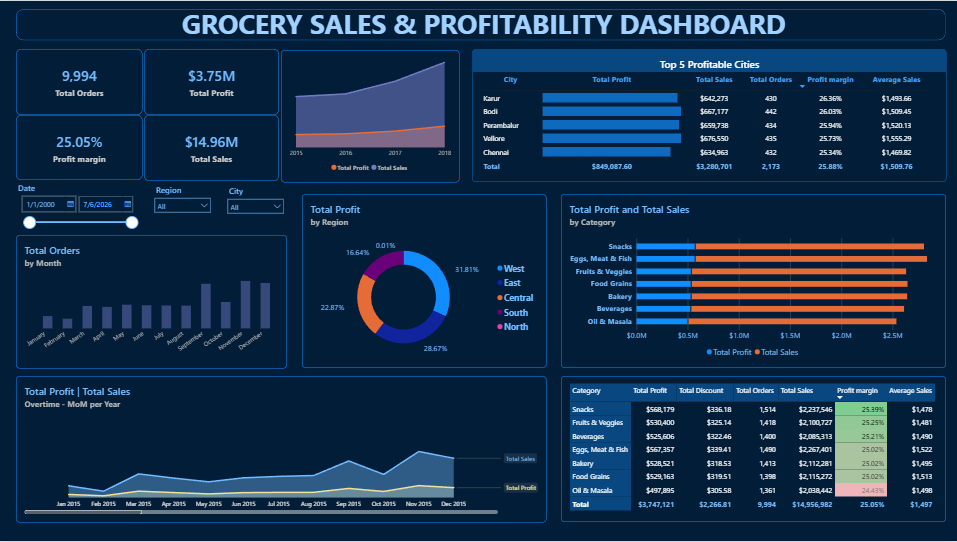
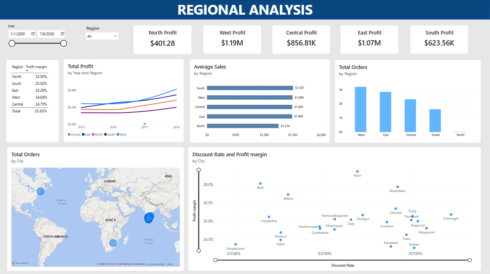
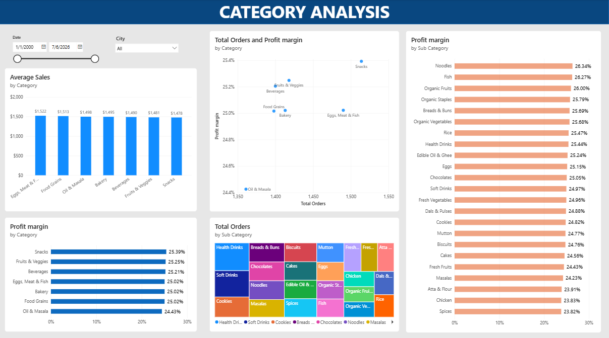
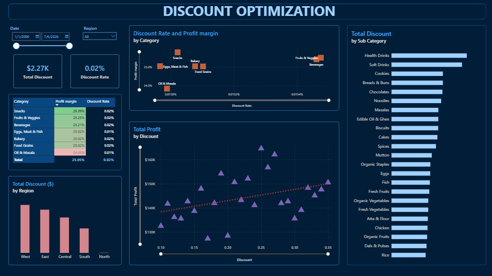
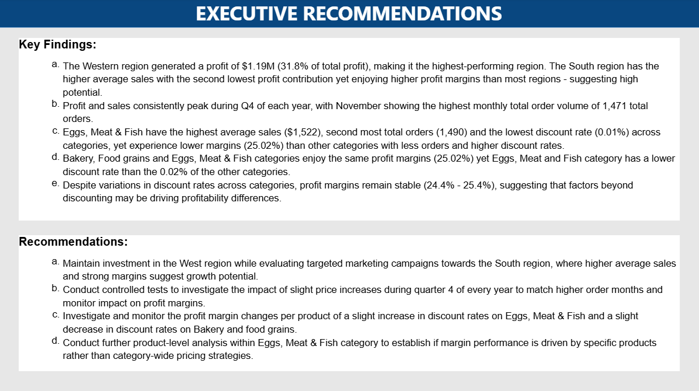

# Grocery Sales Profitability Analysis

## Project Overview
This Power BI project analyzes grocery store sales performance, profitability trends, regional performance, category performance, and discount effectiveness.

## Business Problem
How do sales, profit, and discount strategies influence grocery store performance across regions and categories?

## Objectives
- Identify top-performing regions
- Evaluate category profitability
- Assess discount effectiveness
- Recommend optimization opportunities

## Dataset
- Grocery Sales Dataset
- Period: 2015 - 2018
- 9,994 Orders
- $14.96M Total Sales
- $3.75M Total Profit

## Dashboard Screenshots

## Executive Overview

## Regional Analysis

## Category Analysis

## Discount Optimization

## Executive Recommendations

## Key Findings
1. West region generated the highest profit ($1.19M) contibuting 31.8% of total profit.
2. Snacks is the top-performing category, generating the highest profit, second highest total sales and the highest profit margin (25.39%).
3. Sales and profit consistently peak during Q4.
4. South Region shows strong potential due to high average sales and profit margins despite lower profit value than the West, East and Central regions.
5. Eggs, Meat and Fish generated the highest average sales and one of the highest volume of orders but achieved the same margins as Food Grains & Bakery categories, suggesting an opportunity to improve profitability.

## Recommendations
1. Prioritise the West region and identify driver behind strong performance to replicate in other regions.
2. Continue investing in the Snacks category which delivers high profitability while mainitaining strong sales performance.
3. Increase marketing efforts in the South region to capitalize on the high average sales performance.
4. Test modest price increases during Q4 when demand peaks and monitor margin improvements following price changes.
5. Review discount strategies by category and conduct controlled tests on Eggs, Meat & Fish, Food Grains & Bakery categories to assess possibilities of margin improvement.

## Tools Used:
- Power BI
- DAX
- Power Query
- Excel/CSV

## Files included
- Dashboard Screenshots
- Power BI Dashboard (.pbix)
- Dataset (.csv/xlsx)
- README Documentation

